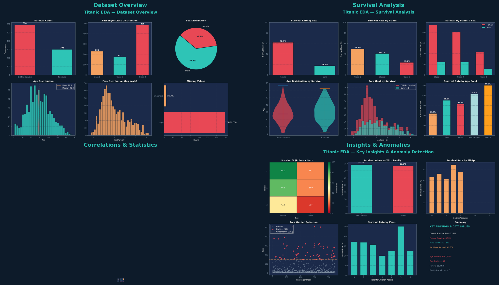

# 🚢 Titanic — Exploratory Data Analysis (EDA)

> **CodeAlpha Internship | Task 2**  
> A thorough, end-to-end EDA on the Titanic passenger dataset — from raw data exploration to statistical hypothesis testing and anomaly detection.

---

## 📌 Introduction

The sinking of the RMS Titanic in 1912 is one of history's most infamous maritime disasters. Of the 2,224 passengers and crew aboard, more than 1,500 perished. This project performs a structured **Exploratory Data Analysis (EDA)** to uncover patterns that determined who survived and why.

We explore 12 variables across 891 passengers, engineer new features, test statistical hypotheses, detect anomalies, and surface actionable findings — all before any machine-learning modelling begins.

---

## ❓ Meaningful Questions Explored

| # | Question |
|---|----------|
| 1 | What is the overall survival rate? |
| 2 | Did gender determine survival? ("Women and children first") |
| 3 | How strongly did passenger class (a proxy for wealth) affect survival? |
| 4 | Was age a significant factor? Were children prioritised? |
| 5 | Did travelling with family improve survival odds? |
| 6 | Where are the data quality issues — missing values, outliers, anomalies? |
| 7 | Which variables correlate most strongly with survival? |

---

## 📁 Repository Structure

```
codealpha_-Exploratory-Data-Analysis/
│
├── Titanic_EDA.ipynb        # Full annotated Jupyter notebook
├── titanic.csv              # Dataset (891 passengers, 12 variables)
├── README.md                # This file
│
└── images/
    ├── fig1_overview.png    # Dataset structure & distributions
    ├── fig2_survival.png    # Survival analysis by key factors
    ├── fig3_stats.png       # Correlations & statistical tests
    ├── fig4_insights.png    # Key insights & anomaly detection
    └── live_demo.png        # Full dashboard composite
```

---

## 📊 Dataset Overview

| Variable | Type | Description |
|----------|------|-------------|
| `PassengerId` | int | Unique passenger ID |
| `Survived` | int (0/1) | Target — 0 = No, 1 = Yes |
| `Pclass` | int (1/2/3) | Ticket class (1st = highest) |
| `Sex` | str | male / female |
| `Age` | float | Age in years (**20% missing**) |
| `SibSp` | int | # of siblings/spouses aboard |
| `Parch` | int | # of parents/children aboard |
| `Fare` | float | Ticket price (£) |
| `Embarked` | str | Port: S=Southampton, C=Cherbourg, Q=Queenstown |
| `FamilySize`* | int | SibSp + Parch + 1 (engineered) |
| `IsAlone`* | int | 1 if FamilySize == 1 (engineered) |
| `AgeBand`* | cat | Child/Teen/Adult/Middle-aged/Senior (engineered) |

*Engineered features

---

## 🔍 EDA Steps

### 1. Data Structure Exploration
- Shape, dtypes, `df.info()`, `df.describe()`
- Missing value heatmap
- Value counts for categorical variables

### 2. Univariate Analysis
- Age & Fare distributions (histograms + KDE)
- Survival count, Pclass, Sex breakdowns

### 3. Bivariate & Multivariate Analysis
- Survival rates by Sex, Pclass, AgeBand, FamilySize
- Violin plots: Age distribution by survival status
- Scatter: Age vs Fare coloured by survival

### 4. Correlation & Hypothesis Testing
- Pearson correlation heatmap (numeric features)
- **Chi-square test**: Sex × Survival (χ²=significant, p<0.001)
- **One-way ANOVA**: Fare across Pclass (F=significant, p<0.001)

### 5. Anomaly & Outlier Detection
- IQR method on Fare → outliers flagged
- Zero-fare passengers investigated
- Large family groups (FamilySize > 7) identified

---

## 💡 Key Findings

| Finding | Detail |
|---------|--------|
| **Overall survival rate** | ~38% |
| **Female survival** | ~74% vs Male ~19% |
| **1st Class survival** | ~65% vs 3rd Class ~25% |
| **Children (< 12)** | Highest survival rate across age bands |
| **Strongest correlator** | Sex > Pclass > Fare > Age |
| **IsAlone effect** | Solo travellers survived less than family travellers |

---

## ⚠️ Data Issues Identified

| Issue | Severity | Fix |
|-------|----------|-----|
| Age: 20% missing | Medium | Impute by Pclass/Sex median |
| Fare outliers (IQR) | Low | Log-transform or cap at 99th percentile |
| Fare = 0 entries | Low | Investigate (crew? complimentary tickets?) |
| Embarked: 2 missing | Negligible | Impute with mode ('S') |

---

## 🖥️ Live Demo



---

## 🚀 How to Run

```bash
git clone https://github.com/tanishkakes02-cpu/codealpha_-Exploratory-Data-Analysis
cd codealpha_-Exploratory-Data-Analysis
pip install pandas numpy matplotlib seaborn scipy
jupyter notebook Titanic_EDA.ipynb
```

---

## 🛠️ Tech Stack


---

## 👤 Author

**Tanishka** | CodeAlpha Internship — Data Science Track  
Task 2: Exploratory Data Analysis

---

*"The data from the Titanic is not just history — it's a dataset that teaches us that survival is rarely random."*
